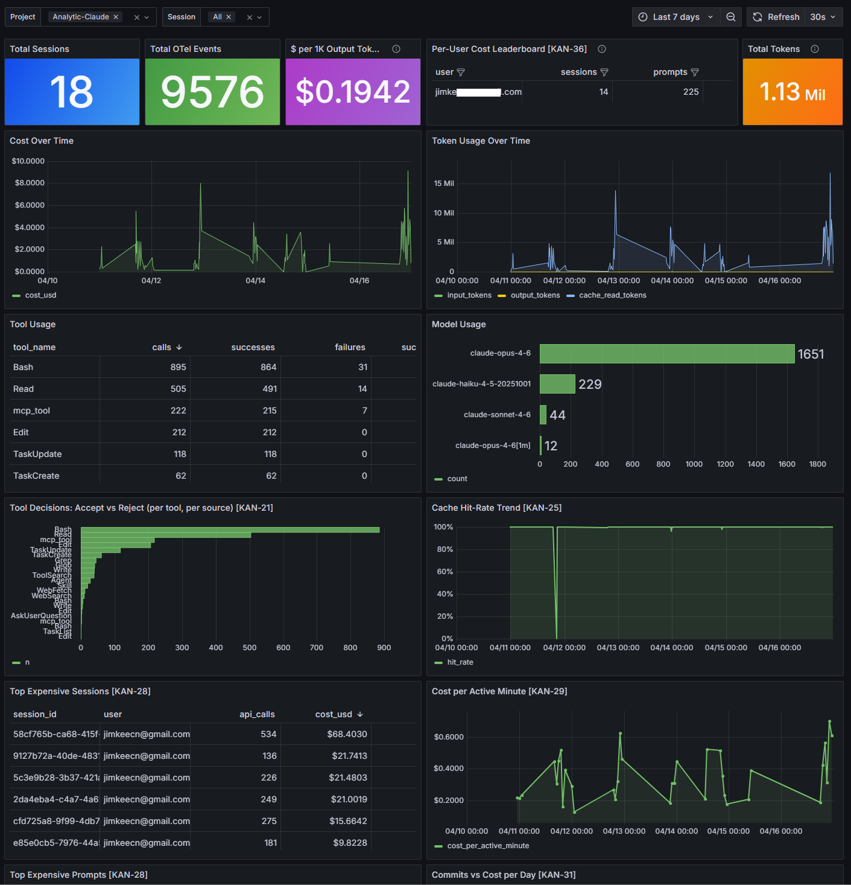
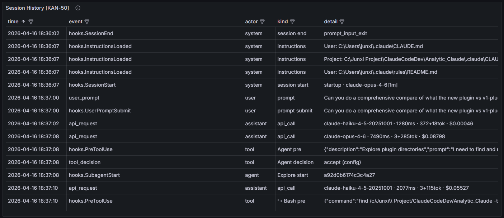
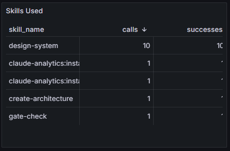
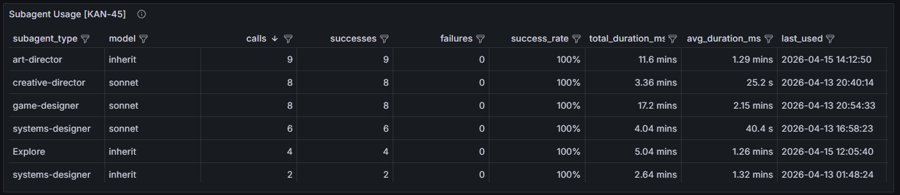
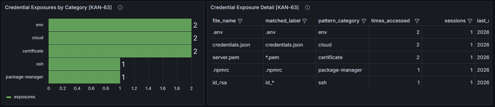
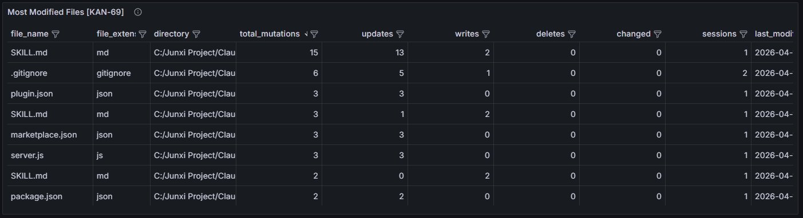
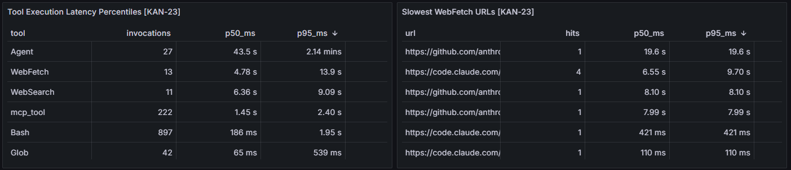

<div align="center">

[English](../README.md) | [中文](README.zh-CN.md) | [日本語](README.ja.md) | Français | [Deutsch](README.de.md)

# Claudalytics

**Tableau de bord analytique local pour Claude Code**

Suivez les coûts, les tokens, l'utilisation des outils et l'activité des sessions dans tous vos projets.
Aucune dépendance cloud. Vos données restent sur votre machine.

[](../LICENSE)
[]()
[]()
[]()

[Installation](#installation) · [Fonctionnalités](#fonctionnalités) · [Mise à jour](#mise-à-jour) · [Utilisation en équipe](#utilisation-en-équipe)

</div>

---



## Installation

### 1. Démarrer la stack analytique

```bash
git clone https://github.com/jimkeecn/Claudalytics.git
cd Claudalytics/docker-stack
docker compose up -d --build
```

Attendez environ 30 secondes. Revenez ensuite à la racine du dépôt et ouvrez Claude Code :

```bash
cd ..
claude
```

Exécutez `/validate-infra` pour vérifier que les 4 conteneurs, les tables et les vues matérialisées sont en bon état.

### 2. Installer le plugin dans votre projet

Ouvrez n'importe quel projet dans Claude Code et installez le plugin :

```
/install-plugin /full/path/to/Claudalytics/plugin
```

### 3. Initialiser

```
/init-claude-analytics
```

Suivez les instructions — confirmez le nom de votre projet, et le skill configure tout automatiquement.

### 4. Redémarrer Claude Code et ouvrir les tableaux de bord

Redémarrez votre session pour que la télémétrie prenne effet, puis ouvrez :

**http://localhost:13000** (admin / admin)

Naviguez vers : **Home > Dashboards > Claude Analytics > Claude Analytics - OTel Overview**

C'est tout. Les données commencent à affluer immédiatement.

---

## Fonctionnalités

### Chronologie des sessions

Chaque action dans une vue unique — prompts, appels API, exécutions d'outils, dispatches de subagents, demandes de permissions, événements de compaction — fusionnés depuis OTel et les hooks dans une chronologie unifiée.



### Analyse des coûts et des tokens

Suivez les dépenses par session, modèle et projet. Consultez le coût par 1K tokens de sortie, l'utilisation des tokens dans le temps, les taux de cache hit, et identifiez vos sessions et prompts les plus coûteux.

### Suivi des skills et des subagents

Surveillez quels skills et subagents Claude utilise, leurs taux de réussite, leur durée et la sélection du modèle. Repérez les inefficacités — un taux élevé de ré-invocation signifie que la première tentative a probablement échoué.

<div align="center">


</div>

### Détection d'exposition de credentials

Détecte automatiquement quand Claude lit des fichiers sensibles — `.env`, credentials AWS, clés SSH, certificats, configurations de bases de données — à travers 38 patterns dans 13 catégories. Aucune configuration nécessaire. Propulsé par une vue matérialisée ClickHouse qui effectue du pattern-matching en temps réel.



### Suivi des mutations de fichiers

Chaque fichier que Claude modifie, écrit ou supprime est suivi avec le type d'action, l'extension de fichier et le répertoire. Voyez quels fichiers sont le plus souvent modifiés et repérez les suppressions inattendues.



### Détection des actions bloquées

Les appels d'outils refusés ou annulés sont automatiquement détectés en suivant les événements PreToolUse qui n'ont jamais reçu de réponse PostToolUse. Utile pour auditer ce que Claude a tenté de faire mais en a été empêché.

### Latence des outils et URLs lentes

Identifiez les goulots d'étranglement de performance — quels outils sont les plus lents au p50/p95, et quelles URLs prennent le plus de temps à récupérer.



### 37 panneaux de tableau de bord

| Catégorie   | Panneaux                                                                                       |
| ----------- | ---------------------------------------------------------------------------------------------- |
| KPIs        | Sessions, événements, coût/1K tokens, total tokens, coût par utilisateur                       |
| Coûts       | Coût dans le temps, sessions/prompts les plus coûteux, coût par minute active, commits vs coût |
| Outils      | Utilisation des outils, utilisation des modèles, taux d'acceptation/rejet, taux de cache hit   |
| Latence     | Percentiles de latence API, latence d'exécution des outils, URLs WebFetch les plus lentes      |
| Chronologie | Historique complet des événements de session (limite de 2000 lignes)                           |
| Workflow    | Skills utilisés, sites web visités, appels serveur MCP, utilisation des subagents              |
| Fichiers    | Fichiers les plus modifiés avec répartition par action                                         |
| Code        | Lignes de code par utilisateur, distribution de la longueur des prompts                        |
| Sécurité    | Actions bloquées, taux de blocage dans le temps, expositions de credentials                    |
| Ops         | Changements de configuration, événements/fréquence de compaction, erreurs récentes             |
| Feedback    | Entonnoir de sondage                                                                           |

---

## Mise à jour

```bash
cd Claudalytics
git pull
cd docker-stack
docker compose up -d --build
```

Les changements de schéma additifs (nouvelles tables, nouvelles vues matérialisées) sont appliqués automatiquement par le hooks-server au démarrage. Si une version inclut des changements de schéma destructifs (modification de types de colonnes, re-partitionnement), exécutez `/migrate-db` depuis le projet Claudalytics — il vous guidera à travers une migration sécurisée côte à côte avec des invites de sauvegarde.

Ensuite, relancez `/init-claude-analytics` dans chaque projet pour mettre à jour les scripts et la configuration des hooks si une nouvelle version est disponible. Le skill ne met à jour que ce qui est en retard — il ne touche pas à ce qui est déjà à jour.

---

## Utilisation en équipe

Ce projet est conçu pour les développeurs individuels. Pour l'adapter à une équipe :

1. **Déployer sur un serveur partagé** — la stack Docker fonctionne sur n'importe quel serveur. Chaque développeur pointe son endpoint OTel et l'URL des hooks vers l'adresse du serveur au lieu de localhost
2. **Ajouter un attribut de nom d'équipe** — incluez `team.name` dans `OTEL_RESOURCE_ATTRIBUTES` en plus de `project.name`
3. **Mettre à jour les tables ClickHouse** — ajoutez une colonne `team_name` aux tables cibles et aux vues matérialisées
4. **Mettre à jour Grafana** — ajoutez une variable déroulante Team et filtrez tous les panneaux par celle-ci

**Avant de déployer sur un serveur, vous devez sécuriser la stack :**

- Définissez un mot de passe ClickHouse (la configuration par défaut n'a pas d'authentification)
- Changez le mot de passe administrateur Grafana
- Restreignez l'accès aux ports avec un pare-feu — n'exposez que les ports 4317 (OTel gRPC), 4319 (hooks) et 3000 (Grafana)
- Ajoutez TLS pour le transport chiffré

Le fichier Docker Compose fonctionne sur un serveur cloud tel quel — mais sans ces mesures de sécurité, vos données de télémétrie sont exposées à quiconque peut atteindre les ports.

---

<div align="center">

**Construit avec [Claude Code](https://claude.ai/code)**

Si ce projet améliore votre workflow, donnez-lui une étoile !

</div>
